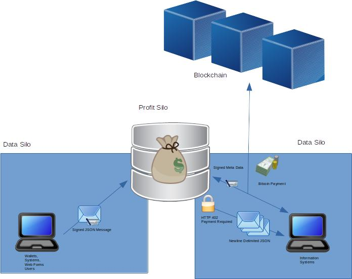

# Profit $ilo
### let data = profit;

This project is an API for collecting, storing and selling data for BSV micropayments, 
with a focus on automated machine to machine interactions.

Tim Middleton 2020

## Project Background

This project was created in response to the Bitcoin Association BSV Hackathon 2020. One of the
stated objectives in the hackathon theme was to 'break down historic industry data silos'.
A data silo is a business unit of an organization that operates in isolation from other units. 
This generally creates a trade off between effective silos and the wider benefit of collaboration (Satell,2017).

In their paper titled 'Abandoning Silos', Mowat Research (2018) identified key barriers to horizontal collaboration. 
Notably, the uneven distribution of costs, data privacy concerns, the lack of a technical solution, and the 
uncertainty of how to do it effectively (Urban, 2018, pp7-9).

This project attempts to address all of those problems. This system stores data as named, ordered lists of signed messages 
which require payment to access. The design may seem similar to the concept of event sourcing, 
but is not designed for tracking every internal state change. It is about: 

- Asynchronous notifications for other systems 
- Allowing the data silo to do what it does best without interference
- Publishing data and documents tailored to the recipients
- Committing to a hash, being able to prove the existence of data at a point in time
- Creating mutual benefit by connecting silos (Satell, 2017)

## System Architecture

This system stores data in a PostgreSQL database. 
The API is a NodeJS app which accepts signed json messages over HTTP (multipart/form-data).
The command line wallet included is also written in NodeJS and uses an SQLite3 database file.

In this diagram there are 2 silos connected to one profit silo instance.
Other configurations could involve many-to-many depending on the context, 
ie the users and who is running the infrastructure.



## System Requirements

- NodeJS v12.9.0
- PostgreSQL 12.3

## Server

### Quick Start

```
1. Use createdb.pgsql to create database. The schema will be created when the server starts.
2. Create a config.json file (check config.js and Configuration section)
3. Run the server.js with config.json as the first arg.
   e.g. node server.js prod-config.json
```

### Configuration

The config json file

```
{
    // PostgreSQL Connection Settings
    "postgres": {
        "user": "",
        "host": "localhost",
        "database": "",
        "password": "",
        "port": 5432,
    },
    
    // API host and port
    "host": "localhost",
    "port": 6767,
    
    // dev or prod env
    "env": "dev",

    // Path for temporary files
    "tempPath": "",

    // Path for storing message attachments
    "storagePath": "",

    // URL to MAPI server
    "mapiUrl": "https://www.ddpurse.com/openapi/mapi/",
    "mapiToken": "561b756d12572020ea9a104c3441b71790acbbce95a6ddbf7e0630971af9424b",
    
    // WIF Private key for signing data
    "signingKey": "",

    // WIF Private Key and Paymail handle, for getting payment destinations
    "paymailClient": {
        "key": null,
        "handle": null
    },

    // Register API keys. Allow address to execute message with tag and subject. 
    // [ Address, Tag, Subject ]
    "permissions": [
        [ "*", "api", "*" ],
        [ "1HML3oox9YQCjFnoStwXULYAiUBxm2G6tw", "testtag", "testsubject" ],
        [ "17rGQ4A3NAkhtbwZBCvNjEzfMtkJz9dTGv", "forms", "*" ]
    ],

    // Configure the outputs for each payment to the server
    "paymentOuts": [
        { "paymail": "1698@moneybutton.com", "sats": 8000 },
        { "address": "12yxtkjgKtaAqLeB3kQn5dgdEwRDS1i249", sats: 8000 }
    ]
}

```

### Message

The api accepts HTTP multipart/form-data requests.
The request should have three fields message,sig,filedata

message: is a JSON string.  
sig: is the signature of the message in hex, signed by message.sender.  
filedata: is a file attachment.  

The message format. 
```
{
    // These are automatically added by the MessageSender object
    messageid: unique string /^[a-zA-Z0-9]+$/
    timestamp: ISO 8601 date
    sender: bitcoin address

    tag: name of message group
    subject: action or message description

    ...
    any other fields
}
```

### Database

The messages are grouped by tag. Each tag has an incrementing index number, and the current taghash.
When a message is saved, the index increments by 1 and the taghash is updated.  

The taghash is computed by concatening the current taghash, with the new message hash.
So each tag is like a mini blockchain of messages. 

The taghash and index is embedded in the payment op_return data so that you can go back and 
check the hashes when it was purchased, and you should be able to check that you have all the messages in a tag.

File attachments are not included in the hash. In that case include the attachment hash, filename etc in the message fields.

### API

Use the tag 'api' and subjects below to perform actions on the server.

1. 'taginfo' - Returns information about tag

```
Request
{
    tag: 'api'
    subject: 'taginfo'
    query: {
        'tag': '...'
    }
}

Response (JSON Envelope)
{
  payload: '{"tag":"forms","index":5,"taghash":"218225f686fb14e8483ae52243efa9d3c02800fe5ae02a6e861df1a34ed6de04"}',
  sig: 'IEJU3kIXU9/iZXS0ErPX4+rky+kn7tnjiO/eOdSf4V68B8sgTtKn2cmuDf7CwoV6cSN/PhWMIbnFJ7Gmu4knzAI=',
  publicKey: '02bece04043c0c8dc573f3376a6564d33b73a81b49a9e37edf3184fdca4726899e',
  encoding: 'UTF-8',
  mimetype: 'application/json'
}
```

2. 'tagdata' - Query tag messages
```
Request
{
    tag: 'api'
    subject: 'tagdata'
    query: {
        'tag': '...'
        'from': index number of first record to return
    }
}

Response
HTTP 402 (application/json)
OR
Response (Newline delimited JSON) (application/octet-stream)
["15967919470525739078060725622","forms",5,"test form","17rGQ4A3NAkhtbwZBCvNjEzfMtkJz9dTGv","2020-08-07T09:19:07.052Z","218225f686fb14e8483ae52243efa9d3c02800fe5ae02a6e861df1a34ed6de04","1f708bb1293b99f6d9a49ae872d8ace02e280d1ef8ca51315361f812ac58f203812661e754caec185ba2bd049400137069ad99aca4a47cbb266bf92baa1d837089","7b226d7974657874223a2268657265206973206d6f72652074657874222c226d6573736167656964223a223135393637393139343730353235373339303738303630373235363232222c227375626a656374223a227465737420666f726d222c2274696d657374616d70223a22323032302d30382d30375430393a31393a30372e3035325a222c22746167223a22666f726d73222c2273656e646572223a2231377247513441334e416b687462775a4243764e6a457a664d746b4a7a3964544776227d"]

each line is a JSON array [ MessageId, tag, index, subject, sender, isodate, taghash(hex), sig(hex), message(hex)]

e.g Buffer.from(line[8],'hex').toString('utf-8')

```

3. 'getattachment' - Download message attachment
```
Request
{
    tag: 'api'
    subject: 'getattachment'
    query: {
        'tag': '...'
        'index': index number of message with attachment
    }
}

Response
HTTP 402 (application/json
OR
The file data (application/octet-stream)

```

4. 'getinvoice' - Generate an invoice to pay for access to a tag
```
Request
{
    tag: 'api',
    subject: 'getinvoice',
    query: { tag }
}

Response (JSON Envelope)
payload: {
    "purpose":"Access to tag:forms for one hour",
    "taghash":{ 
        "tag":"forms",
        "index":5,
        "taghash":"218225f686fb14e8483ae52243efa9d3c02800fe5ae02a6e861df1a34ed6de04"
    },
    "invoiceid":"15970383489761245578926",
    "tx": "txhex with required payment output"
}
```

5. 'payinvoice' - Send transaction paying invoice
```
Request
{
    tag: 'api'
    subject: 'payinvoice'
    invoiceid: invoiceid
    paymenttx: signed tx hex
}

Response
200 OK
{ error: ... }

```

6. 'notifybroadcast' - Notify server that transaction was broadcast
```
Request
{
    tag: 'api'
    subject: 'notifybroadcast'
    invoiceid: invoiceid
}

Response
200 OK
{ error: ... }
```

### 402 Payment Flow

1. The client sends a 'tagdata' query message
``` 
{
    tag: 'api',
    subject: 'tagdata',
    query: {
        tag: tag,
        from: from
    }
}
```

2. The server responds with HTTP 402 Payment Required message

3. The client sends a 'getinvoice' message
```
{
    tag: 'api',
    subject: 'getinvoice',
    query: { tag }
}
```

4. The server response with a JSON Envelope containing invoice details and an unfunded payment transaction.
```
{
    purpose: invoice description
    taghash: { tag, index, hash },
    invoiceid,
    tx: transaction hex   
}
```

5. The client adds inputs and change outputs to the transaction and sends a 'payinvoice' message.
```
{
    tag: 'api',
    subject: 'payinvoice',
    invoiceid: invoiceid,
    paymenttx: transaction hex,
}
```

6. The server checks the outputs match against the invoice id and accepts or rejects the transaction.
7. The client broadcasts the transaction to the BSV network
8. The client sends a notify broadcast message to the server

```
{
    tag: 'api',
    subject: 'notifybroadcast',
    invoiceid: invoiceid
}
```

9. The server checks the status of the transaction with M/API. It will grant access if the transaction is broadcast.
10. The client requests data again.

## CLI Wallet

The CLI Wallet is a simple command line wallet written in NodeJS. It stores transactions and keys in an SQLite3 file.
This is very basic wallet I only created for testing/development purposes as it would allow machine to machine payments.

```
Option
  -t --target <path>                       target database (default: ./wallet.db)

init                                     create a new wallet file
balance                                  show balance
receive                                  generates address to receive funds
send [options] <to> <amount>             create a transaction to send money
  -a, --analyse  show changes
  -p, --process  update the wallet with the tx

broadcast [options]                      broadcast processed transactions
  -l, --list  list the transactions, dont broadcast them

notifyinvoices [options]                 notify invoice payments
  -l, --list  list the invoices, dont notify

download [options] <txid>                download a transaction with txid. it is cached in the home directory.
  -a, --analyse  show changes
  -p, --process  update the wallet with the tx

taginfo <server> <tag>                   get tag info
buyaccess [options] <server> <tag>               pay for access to tag
  -p --pay    pay automatically

tagdata <server> <tag> <from> <savepath>         download data
getattachment <server> <tag> <index> <savepath>  download message attachment
sendmessage <server> <jsonfile> [attachment]     send a message
displaymessages <nldjsonfile>                    print out messages from a saved NLD json file

```

## Site
The site folder contains two example html files that work standalone.  
form1.html demonstrates how a website can use a form and moneybutton to upload data to profitsilo.  
viewdata.html implements 402 Payment using moneybutton swipes.  


## Use Cases

1. Business units sharing data, government departments sharing data.
2. Publish scientific results
3. Logging messages for an API that uses signed json messages.
4. Wallets that upload files and data on chain can embed transaction ids in 
messages or send the transaction as an attachment, and sell their wallet history.

## Prior Work

Some of these files were brought in from another project, memadat.space (online now), which is about paying for static websites. It also uses a CLI and an api based on signed json messages. But there is no wallet, it only uses money button webhooks for payment, and has no database saving any messages.

1. pgutil.js
2. hashfile.js
3. transactor.js
4. sendmessage.js (modified)
5. asynchandler.js

## Demo Server

I have an instance of the server running at https://silo.paywall.vip

## References

Greg Satell, Breaking Down Silos Is a Myth, Do This Instead, 2017  
    https://www.inc.com/greg-satell/breaking-down-silos-is-a-myth-do-this-instead.html

MICHAEL CRAWFORD URBAN, Abandoning Silos, Mowat Research, 2018  
    https://munkschool.utoronto.ca/mowatcentre/wp-content/uploads/publications/178_abandoning_silos.pdf